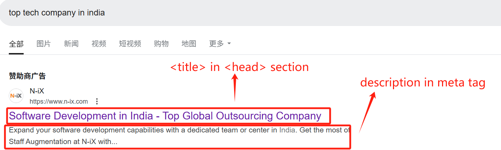

# 🧱 HTML base

## 1 What is HTML

It is used to create webpage or layout.

features:

* latest version is html5
* not a case sensitive language
* extension .html or .htm
*   everything is on tags, every tag should be closed

    ```html
    <hr></hr>//<hr />
    ```

## 2 Structure of a HTML

```html
<!Doctype html>//indicate that this is a html 5 document
<html>
<head></head>//we defined meta, title, styles, js script
<body></body>//everything in this section will be rendered in browser.
</html>
```

## 3 `<head>` Section

`<head>` is used to define the head of the document, which is a container for all header elements. The elements in the header can refer to scripts, indicate to the browser where to find style sheets, provide meta-information, and so on.

The header of a document describes a variety of attributes and information about the document, including the title of the document, its location on the Web, and its relationship to other documents. Most of the data contained in the head of a document is not actually displayed to the reader as content.

The following tags can be used in the head section:

* base
* link
* **meta**
* **title**: This defines the title of the document, which is <mark style="background-color:yellow;">**the only required element**</mark> in the head section.
* **style**
* **script**

### 3.1 \<meta> Tag Details

```html
<meta charset="UTF-8">
<meta name="viewport" content="width=device-width, initial-scale=1.0">
<meta name="description" content="High-quality custom software development">
<meta name="keywords" content="software, development, web design">
<meta name="author" content="John Doe">
```

#### Purpose of `<meta>` Tags:

| Attribute     | Description                                                              |
| ------------- | ------------------------------------------------------------------------ |
| `charset`     | Character encoding. Usually set to UTF-8                                 |
| `viewport`    | Used for **responsive design**; ensures layout fits on all device widths |
| `description` | Short summary shown in search engines under the link                     |
| `keywords`    | Search terms for SEO                                                     |
| `author`      | Author of the document                                                   |

💡 _Meta tags help with SEO (Search Engine Optimization) and are mainly used by digital marketers._

<figure><figcaption></figcaption></figure>

### 3.2 \<title> Tag

Appears on the browser tab

<figure><figcaption></figcaption></figure>

```html
<title>My First HTML Page</title>
```

Example use:

* Helps users identify tabs
* Plays a role in SEO ranking

## 4 \<body> Section

### 4.1 🔠 Text Tags & Structure

```html
<h1>Heading 1</h1> <!-- largest -->
<h6>Heading 6</h6> <!-- smallest -->

<p>This is a paragraph.</p>
<br> <!-- line break -->
<hr> <!-- horizontal line -->

<b>Bold</b> <i>Italic</i>
<sup>2</sup> <sub>2</sub>
```

<figure><figcaption></figcaption></figure>

* Superscript (`<sup>`) for expressions like 22
* Subscript (`<sub>`) for H2O

[](https://codesandbox.io/p/sandbox/frontend-notebook-zpljff)

### 4.2 🖼️ Inserting Images

```html

```

* `src`: Source of the image (local or URL)
* `alt`: Alternative text (for accessibility, or shown if the image fails to load)

🔸 Tip: Use [Lorem Picsum](https://picsum.photos/) for placeholder images.

Internal image example:

```html

```

### 4.3 📋 Lists

#### Ordered List (Numbered)

```html
<ol type="A" start="3">
  <li>Apple</li>
  <li>Banana</li>
</ol>
```

<figure><figcaption></figcaption></figure>

Types: `1` (default), `A`, `a`, `I`, `i`\
`start`: Starting number/letter

#### Unordered List (Bulleted)

```html
<ul type="square">
  <li>React</li>
  <li>Angular</li>
</ul>
```

<figure><figcaption></figcaption></figure>

Types: `disc` (default), `circle`, `square`

#### Nested List&#x20;

<figure><figcaption></figcaption></figure>

```html
<ol type="I">
  <li>Courses
    <ul>
      <li>React</li>
      <li>Node</li>
      <li>Angular</li>
    </ul>
  </li>
  <li>Duration
    <ul>
      <li>1 Month</li>
      <li>2 Months</li>
    </ul>
  </li>
</ol>
```

[](https://codesandbox.io/p/sandbox/frontend-notebook-zpljff)

### 4.4 ✏️ Special Characters

```html
&copy; 2024 All rights reserved.
```

Outputs: © 2024 All rights reserved.

Other examples:

* `&lt;` → `<`
* `&gt;` → `>`
* `&amp;` → `&`
