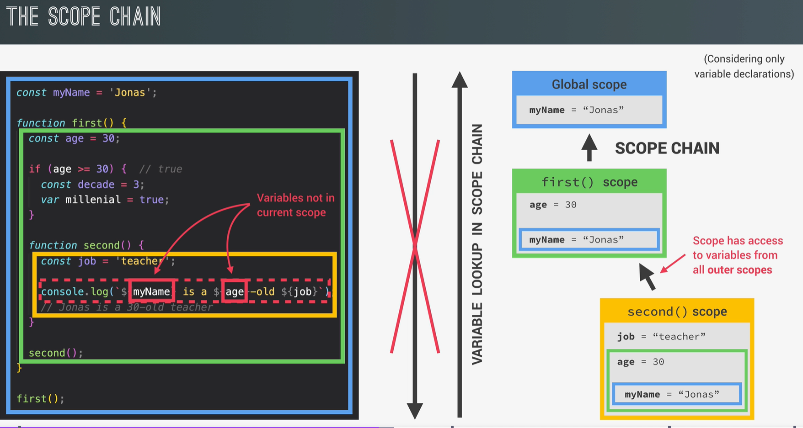
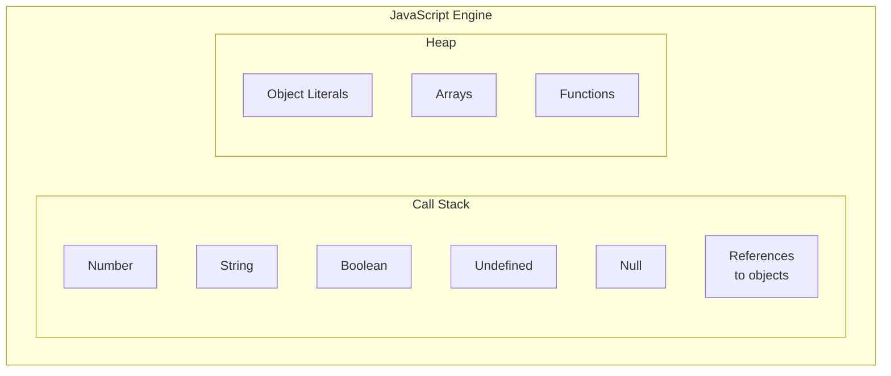

# ⚙️ How does JS work

## 1 How to define JavaScript?

JS is a **high-level, garbage-collected, interpreted or just-in time compiled, multi-paradigm, prototype-based object-oriented, dynamic, single threaded** programming language with **first-class function and non-blocking event loop.**

* **High-level**: It does not require manual memory management, relying instead on **garbage collection** to handle unused objects.
* **Interpreted or Just-in-time Compiled**: JavaScript code needs to be translated into machine code before execution, a process handled by the **JavaScript engine**.
* **Multi-paradigm**: It supports different programming paradigms, including **imperative, object-oriented, and functional programming**.
* **Object-oriented**: It follows a **prototype-based** approach, where objects inherit properties and methods from a prototype.
* **First-class Functions**: Functions can be treated like variables, allowing them to be **passed as arguments** and **returned from other functions**, enabling techniques like **higher-order functions** and callbacks.
* **Dynamically Typed**: Variable types are determined at runtime and can change dynamically.
* **Single-threaded & Non-blocking**: JavaScript operates on a **single thread**, using an **event loop** to handle asynchronous tasks efficiently without blocking execution.

## 2 What is a JS engine?

A **JavaScript engine** is a program that executes JavaScript code.&#x20;

> _Each browser has its own JavaScript engine, with Google's **V8 engine** being one of the most well-known. The **V8 engine** powers **Google Chrome** and **Node.js**, enabling JavaScript to run outside of browsers._

A JavaScript engine consists of two key components:

<figure><figcaption></figcaption></figure>

* **Call Stack**: Where JavaScript code is executed using **execution contexts**. (store primitive data type values)
* **Heap**: An unstructured memory pool where objects are stored.

## 3 How JavaScript Code is Compiled and Executed?

There are 3 ways to translate code:

### **3.1 Compilation**

<figure><figcaption><p><a href="https://www.udemy.com/the-complete-javascript-course/?couponCode=C3GITHUB10">https://www.udemy.com/the-complete-javascript-course/?couponCode=C3GITHUB10</a></p></figcaption></figure>

* **Compilation**: Entire code is converted into machine code at once, and written to a portable binary file that can be executed by a computer.

### **3.2 Interpretation**

<figure><figcaption><p><a href="https://www.udemy.com/the-complete-javascript-course/?couponCode=C3GITHUB10">https://www.udemy.com/the-complete-javascript-course/?couponCode=C3GITHUB10</a></p></figcaption></figure>

* **Interpretation**: The source code is read **line by line** and executed **immediately** without generating a separate executable file.

### **3.3 JavaScript’s Evolution: From Interpretation to Just-In-Time (JIT) Compilation**

<figure><figcaption><p><a href="https://www.udemy.com/the-complete-javascript-course/?couponCode=C3GITHUB10">https://www.udemy.com/the-complete-javascript-course/?couponCode=C3GITHUB10</a></p></figcaption></figure>

The entire code is converted into machine code at once, then executed immediately. (The diff between JIT and traditional compilation is portable file.)

Originally, JavaScript was **purely interpreted**, meaning it executed code line by line, making it slower than compiled languages like C++. However, modern JavaScript engines use a **hybrid approach** called **Just-In-Time (JIT) Compilation**:

<figure><figcaption><p><a href="https://www.udemy.com/the-complete-javascript-course/?couponCode=C3GITHUB10">https://www.udemy.com/the-complete-javascript-course/?couponCode=C3GITHUB10</a></p></figcaption></figure>

**Step**:one:: **Parses** JavaScript code into an **Abstract Syntax Tree (AST)**:&#x20;

* The code is broken down into **tokens** (e.g., `const`, `function`).
* These tokens are structured into an **Abstract Syntax Tree (AST)**.
* The AST is used to generate machine code.

**Step**:two:: **Compile** the AST into machine code.

**Step**:three:: **Executes** the machine code **immediately**.

**Step**:four: : **Optimizes** and **recompiles** parts of the code dynamically during execution:&#x20;

* The engine first generates an **unoptimized** version of the code for fast execution.
* While the program runs, the engine **identifies inefficient code** and **recompiles it** into a more optimized version **without stopping execution**.

> This **JIT compilation** is why JavaScript can now run efficiently, even for complex applications like **Google Maps**.

## 4 JS Runtime

A **JavaScript runtime** is the environment that provides everything needed for JavaScript to run. The most common runtime is **the browser**, but **Node.js** is another runtime.

### 4.1 A **browser** JavaScript runtime

<figure><figcaption><p><a href="https://www.udemy.com/the-complete-javascript-course/?couponCode=C3GITHUB10">https://www.udemy.com/the-complete-javascript-course/?couponCode=C3GITHUB10</a></p></figcaption></figure>

1. **JavaScript Engine** (e.g., V8).
2. **Web APIs**: Provided by the browser, including:
   * **DOM (Document Object Model)** (for manipulating HTML elements)
   * **Timers** (`setTimeout`, `setInterval`)
   * **AJAX / Fetch API** (for making network requests)
   * **console.log()**
3. **Callback Queue**: Stores functions waiting to be executed (e.g., event listeners: click, timer, etc.).
4. **Event Loop**: Moves tasks from the **callback queue** to the **call stack** when it is empty. JavaScript is **single-threaded**, meaning it can only run one task at a time. However, it uses **an event loop** to handle multiple tasks efficiently. Example:
   * A button click event occurs.
   * The event’s callback function is added to the callback queue.
   * Once the call stack is empty, the event loop moves the callback function from the queue to the stack for execution.

### 4.2 Node.js JavaScript runtime

JavaScript can also run outside of browsers using **Node.js**, which has a different **runtime** structure:

<figure><figcaption><p><a href="https://www.udemy.com/the-complete-javascript-course/?couponCode=C3GITHUB10">https://www.udemy.com/the-complete-javascript-course/?couponCode=C3GITHUB10</a></p></figcaption></figure>

* **No Web APIs** (since there is no browser).
* Instead, it includes:
  * **C++ bindings** (for low-level system operations).
  * **Thread Pool** (for handling heavy tasks like file I/O).
  * **Built-in Modules** (e.g., `fs` for file system operations, `http` for server creation).

Despite these differences, **Node.js follows the same JavaScript execution model** (event loop, callback queue, JIT compilation).

## 5 How is JavaScript Code Executed？

<figure><figcaption></figcaption></figure>

JavaScript code **execution** happens **inside** the **JavaScript engine**.&#x20;

Execution happens in a structured manner using **execution contexts**. Execution contexts are managed by **the call stack**, which determines the order of function execution.&#x20;

* Exactly one **global execution context** (EC): Default context, created for code that is not inside any function (top-level).&#x20;
* One **execution context per function**: For each function call, a new execution context is created.

<figure><figcaption><p><a href="https://www.udemy.com/the-complete-javascript-course/?couponCode=C3GITHUB10">https://www.udemy.com/the-complete-javascript-course/?couponCode=C3GITHUB10</a></p></figcaption></figure>

**Every execution context goes through two main phases: Creation and Execution.**

**The Creation Phase**

Happens before the actual execution. In this phase:

1. A **new execution context** is created.
2. The **variable environment** is set up:
   * Variables are assigned `undefined` (if declared with `var`).
   * `let` and `const` variables are in the **Temporal Dead Zone (TDZ)**.
3. Function **declarations** are stored in memory.
4. The **scope chain** is set up.
5. The **`this` keyword** is defined.(except for arrow functions)
6. For functions, an **arguments object** is created (except for arrow functions).

**The Execution Phase**

* The **JavaScript engine runs the code line by line**.
* Assignments and expressions are executed.

**Step-by-step Execution in the Call Stack(FILO)**

```javascript
function first() {
  console.log("First function");
  second();
}

function second() {
  console.log("Second function");
  third();
}

function third() {
  console.log("Third function");
}

first();

```

1. Global execution context is **created**.
2. `first()` is called, **creating** a new execution context.
3. `second()` is called inside `first()`, **adding** a new execution context.
4. `third()` is called, **adding** another execution context.
5. `third()` finishes **execution**, and its context is removed.
6. `second()` finishes, and its context is removed.
7. `first()` finishes, and its context is removed.
8. **The program returns to the global execution context.**

## 6 Scope and Scope Chain

### **6.1 Scope**

**Scoping**: How our program’s variables are organized and accessed. “Where do variables live?” or “Where can we access a certain variable, and where not?”.

**Lexical scoping**: Scoping is controlled by the placement of functions and blocks in the code;&#x20;

**Scope**: Space or environment in which a certain variable is declared (variable environment in case of functions). **There is global scope, function scope, and block scope.**&#x20;

Scope of a variable: The Region of our code where a certain variable can be accessed.

<table><thead><tr><th width="164">Scope Type</th><th width="248">Definition</th><th>Key Points</th><th data-hidden>Example</th></tr></thead><tbody><tr><td><strong>Global Scope</strong></td><td><p>Variables are declared outside any function or block.</p><p>accessible everywhere.</p></td><td>✅ Defined outside any function/block.<br>✅ Accessible globally.</td><td>```js</td></tr><tr><td><strong>Function Scope</strong></td><td><p>Variables are accessible only inside the function where they are declared.</p><p>also called local scope.</p></td><td>✅ Accessible only within the function.<br>❌ Not accessible outside the function.</td><td>```js</td></tr><tr><td><strong>Block Scope (ES6)</strong></td><td><p>Variables are accessible only inside a block (if, for, etc.); </p><p>applies to <code>let</code> and <code>const</code>.</p></td><td>✅ <code>let</code> and <code>const</code> are block-scoped.<br>❌ Not accessible outside the block.<br>⚠️ Functions are also block-scoped (strict mode).</td><td>```js</td></tr></tbody></table>

### **6.2 scope chain**

The **scope chain** determines how variables are resolved when accessed.

#### **How it Works**

* If a variable **is not found in the current scope**, JavaScript **looks up in the outer scopes**.
* This continues **until it finds the variable** or reaches the **global scope**.
* **If the variable is not found, a `ReferenceError` occurs**.
* **Function Scope**: Functions create their own scopes. Variables inside functions are **only accessible within the function**.
* **Block Scope (ES6)**: `let` and `const` **are confined to the block `{}` they are declared in**.

<figure><figcaption><p>ES6</p></figcaption></figure>

<figure><figcaption><p>not ES6</p></figcaption></figure>

### **6.3 Scope Chain vs. Call Stack**

Many people confuse **scope chain** and **call stack**, but they are different.

* **Call Stack**: Determines the **execution order of functions**.
* **Scope Chain**: Determines **variable access hierarchy** based on where functions are written.

<figure><figcaption></figcaption></figure>

diff: 1, scope include variables from outer scope (diff with variable environment) 2, the scope chain depend the location of the function code, and the call stack arranges the order of calling a function.

## 7 Variable Environment: Hoisting and TDZ

### 7.1 Hoisting

Hoisting: Makes some types of variables accessible/usable in the code before they are
\
actually declared. “Variables lifted to the top of their scope”.

BEHIND THE SCENES: Before execution, the code is scanned for variable declarations, and for each variable, a new
&#x20;property is created in the variable environment object.

| Variable Type                     | Hoisted?                            | Initial Value                   | Scope                                   |
| --------------------------------- | ----------------------------------- | ------------------------------- | --------------------------------------- |
| **Function Declarations**         | ✅ Yes                               | Actual function                 | Block (Strict Mode), Otherwise Function |
| **`var` Variables**               | ✅ Yes                               | `undefined`                     | Function                                |
| **`let` and `const` Variables**   | ❌ No(Technically Yes, but unusable) | `<uninitialized>`, TDZ          | Block                                   |
| **Function Expressions & Arrows** | 🤷 Depends                          | Depends on `var` or `let/const` | Depends                                 |

**Why Does Hoisting Exist?**

* **Allows function declarations to be used before they appear in the code.**
* **Hoisting of `var` was a byproduct**—it was **not intentional** but necessary at the time.

### **7.2 Temporal Dead Zone (TDZ)**

The **TDZ** is the zone **between the beginning of the scope and the declaration of the variable**.

**Variables in TDZ cannot be accessed** before initialization.

**Why Does TDZ Exist?**

✅ **Helps Catch Errors Early**

* **Avoids using variables before declaration**, which can lead to unintended behaviors.
* **Provides more predictable behavior** than `var`, which defaults to `undefined`.

✅ **Makes `const` Variables Work Correctly**

* Since **`const` cannot be reassigned**, JavaScript must **prevent access before initialization**.

### 7.4 Practice

```javascript
// var
console.log(me);//me is defined by var. output should be 'undefined'

var me = 'Jonas';

// Functions
console.log(addDecl(2, 3));//addDecl is declared as a function. output is 5.
// Arrow function + var
console.log(addArrow);// this arrow function is defined by a var. output is undefined.

function addDecl(a, b) {
  return a + b;
}

var addArrow = (a, b) => a + b;

var x = 1;
let y = 2;
const z = 3;
//When we use var to declare sth, the global(window) object adds a property.
console.log(x === window.x);
//if you use node.js then it should be global.x. 
// The output should be true
```

<figure><figcaption></figcaption></figure>

```javascript
// Variables
console.log(job);
let job = 'teacher';//or const job  = 'teacher';
```

<figure><figcaption></figcaption></figure>

## 8 Key Word: this

The `this` keyword is a special variable created for every execution context (function). It refers to the "owner" of the function in which it is used. The value of `this` is determined **when the function is called**, not when it is written.

**Key Characteristics of `this`**

* `this` is **not static**; its value depends on **how the function is called**.
* It is **only assigned at the time of function execution**.
* The value of `this` follows a set of **rules based on function call types**.

<table><thead><tr><th width="186.66668701171875">Function Call Type</th><th>Value of this</th><th></th></tr></thead><tbody><tr><td>in a <strong>Method called by an object</strong></td><td><code>&#x3C;Object that called the method></code></td><td><code>this</code> refers to the object that owns the method.</td></tr><tr><td>in a <strong>Simple Function</strong></td><td><code>undefined</code> in strict mode, <code>window</code> in sloppy mode</td><td>In strict mode, <code>this</code> is <code>undefined</code>; otherwise, it's the <code>window</code> object in browsers.</td></tr><tr><td>in <strong>Arrow Function</strong></td><td><code>this</code> of surrounding function (lexical <code>this</code>)</td><td>Arrow functions <strong>do not</strong> get their own <code>this</code>; they inherit it from the surrounding scope.</td></tr><tr><td>in <strong>Event Listener</strong></td><td><code>&#x3C;DOM Element></code></td><td><code>this</code> refers to the DOM element to which the event handler is attached.</td></tr><tr><td>in <strong>new, call, apply, bind</strong></td><td><em>(Covered later in the course)</em></td><td><code>new</code> binds <code>this</code> to the newly created object. <code>call</code>, <code>apply</code>, and <code>bind</code> explicitly set <code>this</code>.</td></tr></tbody></table>

### Practice

#### method borrowing

```javascript
const jonas = {
  year: 1991,
  calcAge: function () {
    console.log(this);
    console.log(2037 - this.year);
  },
};
jonas.calcAge();

const matilda = {
  year: 2017,
};

matilda.calcAge = jonas.calcAge;//method borrowing
matilda.calcAge();
```

<figure><figcaption></figcaption></figure>

```javascript
//in a Simple Function
“use strict”
const calcAge = function (birthYear) {
  console.log(2037 - birthYear);
  console.log(this);
};
calcAge(1991);
```

<figure><figcaption></figcaption></figure>

## 9 Regular Function vs Arrow Function

### **9.1 `this` Keyword in Regular Functions and Arrow Functions**

* The `this` keyword is a special variable created for every execution context.
* It does **not** point to the function itself, but rather to the **object that called the function**.
* The value of `this` is determined when the function is **executed**, not when it is defined.

### **9.2 Pitfalls of Using Arrow Functions as Methods**

**Arrow functions do not have their own `this` keyword**; instead, they inherit `this` from their surrounding lexical scope.

When an arrow function is used inside an object method, `this` does **not** refer to the object, but rather to the global scope (`window` in browsers).

Example:

```javascript
const jonas = {
  firstName: 'Jonas',
  greet: () => {
    console.log(this);
    console.log(`Hey ${this.firstName}`);
  },
};
jonas.greet(); // Output: "Hey undefined"
```

The `this` inside the arrow function `greet()` is inherited from the **global scope**, where `firstName` is not defined.

### **9.3 Best Practice for Using `this` in Methods**

* **Do not use arrow functions as object methods**.
* Always use **regular functions** when defining methods inside objects:

```javascript
const jonas = {
  firstName: 'Jonas',
  greet: function () {
    console.log(this);
    console.log(`Hey ${this.firstName}`);
  },
};
jonas.greet(); // Output: "Hey Jonas"
```

### **9.4 Nested Functions and `this` Keyword**

If a **regular function** is used inside a method, its `this` value will be **undefined** in strict mode.

Example:

```javascript
const jonas = {
  year: 1991,
  calcAge: function () {
    console.log(2037 - this.year);
    
    function isMillenial() {
      console.log(this); // Undefined in strict mode
      console.log(this.year >= 1981 && this.year <= 1996);
    }
    isMillenial();
  },
};
jonas.calcAge();
```

:question:**Why**

`isMillenial()` is a **regular function call**, not a method, so `this` inside it is `undefined`.

:thumbsup:**Solutions to Fix `this` inside Nested Functions**

1.  **Using a variable (`self` or `that`) to capture `this`:**

    ```javascript
    const jonas = {
      year: 1991,
      calcAge: function () {
        console.log(2037 - this.year);

        const self = this;
        function isMillenial() {
          console.log(self.year >= 1981 && self.year <= 1996);
        }
        isMillenial();
      },
    };
    jonas.calcAge();
    ```

    `self` stores `this` from `calcAge()`, allowing `isMillenial()` to access the correct object.
2.  **Using an arrow function:**

    ```javascript
    const jonas = {
      year: 1991,
      calcAge: function () {
        console.log(2037 - this.year);

        const isMillenial = () => {
          console.log(this.year >= 1981 && this.year <= 1996);
        };
        isMillenial();
      },
    };
    jonas.calcAge();
    ```

    The arrow function **inherits `this` from its parent scope**, which is `calcAge()`.

### **9.5 Arguments Object in Regular Functions vs. Arrow Functions**

:white\_check\_mark:Regular functions have access to the **`arguments` object**, which stores all passed arguments.

:x:Arrow functions **do not** have `arguments`.

Example:

```javascript
const addExpr = function (a, b) {
  console.log(arguments);
  return a + b;
};
addExpr(2, 5, 8, 12); 
// Output: Arguments(4) [2, 5, 8, 12]

const addArrow = (a, b) => {
  console.log(arguments);
  return a + b;
};
addArrow(2, 5, 8); 
// Output: Uncaught ReferenceError: arguments is not defined
```

:question:**Why**

* `arguments` is available in **regular functions**, but **not** in arrow functions.
* In modern JavaScript, **spread operators (`...args`)** replace `arguments`. Example:

```javascript
// arguments keyword
const addExpr = function (...args) {
  console.log(args);
  console.log(arguments);
  let sum = 0;
  for(let arg of args) sum += arg;
  return sum;
};
addExpr(2, 5);
addExpr(2, 5, 8, 12);
```

<figure><figcaption></figcaption></figure>

```javascript
var addArrow = (...args) => {
  console.log(args);
  return 0;
};
addArrow(2, 5, 8);
```

<figure><figcaption></figcaption></figure>

### **9.6 Key Differences Between Regular Functions and Arrow Functions**

| Feature                 | Regular Function                                                        | Arrow Function                                                  |
| ----------------------- | ----------------------------------------------------------------------- | --------------------------------------------------------------- |
| `this` Binding          | `this` is dynamically determined (based on how the function is called). | `this` is lexically inherited (from surrounding scope).         |
| Used as Object Methods? | ✅ Yes (recommended)                                                     | ❌ No (inherits from global scope, causing unexpected behavior). |
| Used in Callbacks?      | ✅ Yes                                                                   | ✅ Yes (better for concise code).                                |
| `arguments` Object?     | ✅ Available                                                             | ❌ Not available (use `...args`).                                |
| Suitable for Methods?   | ✅ Yes                                                                   | ❌ No (should be avoided).                                       |

## 10 Memory Management: Primitive vs Object

### **10.1 The Memory Lifecycle in JavaScript**

Unlike lower-level languages like C or C++, JavaScript automatically manages memory through a three-step lifecycle:

1️⃣ **Allocate Memory** – Memory is reserved when a variable is declared.

```js
let temp;  // A memory space is allocated to store this value
```

2️⃣ **Use Memory**  – The allocated memory is used when values are read, updated, or manipulated.

```js
temp = temp + 5; // The value stored in memory is updated
```

3️⃣ **Release Memory** – When a value is no longer needed, JavaScript automatically removes it to free up space.

```js
temp = null; // Memory space for temp is released when no longer referenced
```

### **10.2 Where Is Memory Allocated?**

Memory allocation depends on **data type**:

#### **🔹 Primitives (Stored in Call Stack)**

Primitive data types (e.g., `Number`, `String`, `Boolean`, `Undefined`, `Null`, `Symbol`, `BigInt`) are stored directly in the **Call Stack**.

#### **🔹 Objects (Stored in Heap)**

Objects, arrays, and functions are stored in the **Heap**, and **only a&#x20;**<mark style="background-color:green;">**reference**</mark>**&#x20;(memory address) is stored in the Call Stack**.

#### **Diagram: Memory Allocation**



### **10.3 Understanding Object References in Memory**

Unlike primitive values, **objects are referenced**. This means when you assign an object to another variable, you are copying **the reference, not the actual object**.

**Example: Reference Behavior**

```js
const location = {
  city: "Faro",
  country: "Portugal"
};

const newLocation = location; // Copying the reference, not the object
newLocation.city = "Lisbon";

console.log(location.city); // "Lisbon" (Original object is also modified)
```

:question:**Why**\
Both `location` and `newLocation` point to the **same memory address** in the Heap.

#### :thumbsup:**Solution(next chapter** :arrow\_heading\_down:**): How to Create a True Copy (Avoid Mutations)**

## 11 Object References: Shallow vs deep copy

### **11.1 Shallow Copy**

To create a separate copy of an object (not just a reference), you need to **clone it**:

```js
// Using Object.assign()
const newLocation = Object.assign({}, location);
newLocation.city = "Lisbon";

console.log(location.city); // "Faro" (Original object remains unchanged)
```

```js
// Using Spread Operator
const newLocation = { ...location };
newLocation.city = "Lisbon";

console.log(location.city); // "Faro" (Original object remains unchanged)
```

:warning:However, these methods create a <mark style="background-color:green;">**shallow copy**</mark>, meaning nested objects are still referenced! **Example:**&#x20;

```js
const obj = { name: "Jonas", details: { age: 30 } };
const copy = { ...obj };
copy.details.age = 35;

console.log(obj.details.age); // 35 (Shallow copy still shares nested references)
```

### **11.2 Deep Copy**

```js
const deepCopy = JSON.parse(JSON.stringify(obj));
deepCopy.details.age = 35;

console.log(obj.details.age); // 30 (Original object remains unchanged)
```

| **Copy Type**    | **What It Copies**        | **Example Method**                                                    |
| ---------------- | ------------------------- | --------------------------------------------------------------------- |
| **Shallow Copy** | Only top-level properties | `Object.assign()`, Spread `{ ...obj }`                                |
| **Deep Copy**    | Includes nested objects   | `JSON.parse(JSON.stringify(obj))`, `structuredClone(obj)` (modern JS) |

## 12 Memory Management: Garbage Collection

In the previous chapters, we discussed allocating and updating memory. Let's now move to the third stage of memory management in JS.


JavaScript automatically removes **unused objects** from memory through **Garbage Collection (GC)**. Modern engines use the **Mark-and-Sweep Algorithm**.

### **12.1 Mark-and-Sweep Algorithm**

**Step**:one:**: Mark Phase**

:arrow\_heading\_down:The engine **identifies all reachable objects** from the **root (**<mark style="background-color:green;">**global execution context**</mark>**,&#x20;**<mark style="background-color:green;">**function calls**</mark>**,&#x20;**<mark style="background-color:green;">**event listeners or timer**</mark>**,&#x20;**<mark style="background-color:green;">**closure**</mark>**, etc.).**\
:arrow\_heading\_down:It **follows references** to determine **which objects are still in use** (<mark style="background-color:green;">**alive**</mark>).\
Objects that are **not reachable** are **considered dead** :skull: (<mark style="background-color:green;">**unmarked**</mark>).

**Step**:two:**: Sweep Phase**

**Unreachable objects** (those that cannot be accessed anymore) **are deleted**, and memory is reclaimed.

<figure><figcaption></figcaption></figure>

### **12.2 Avoiding Memory Leaks**

**Memory leak**: When objects that are
&#x20;no longer needed are incorrectly
&#x20;still reachable, and therefore not
&#x20;being garbage collected

**Common Causes of Memory Leaks(just have an overview, we'll introduce some concepts like closure and timer later.)**

| **Type**                        | **Description**                                                               | **Solution**                                  |
| ------------------------------- | ----------------------------------------------------------------------------- | --------------------------------------------- |
| **Global Variables**            | Variables declared without `let` or `const` become global and never collected | Always use `let` or `const`                   |
| **Unremoved Event Listeners**   | Event handlers stay in memory if not removed                                  | `element.removeEventListener(event, handler)` |
| **Uncleared Timers**            | `setInterval()` continues running unless cleared                              | `clearInterval(timerID)`                      |
| **Closures Holding References** | Functions retain references to outer variables even after execution           | Avoid unnecessary closures                    |

