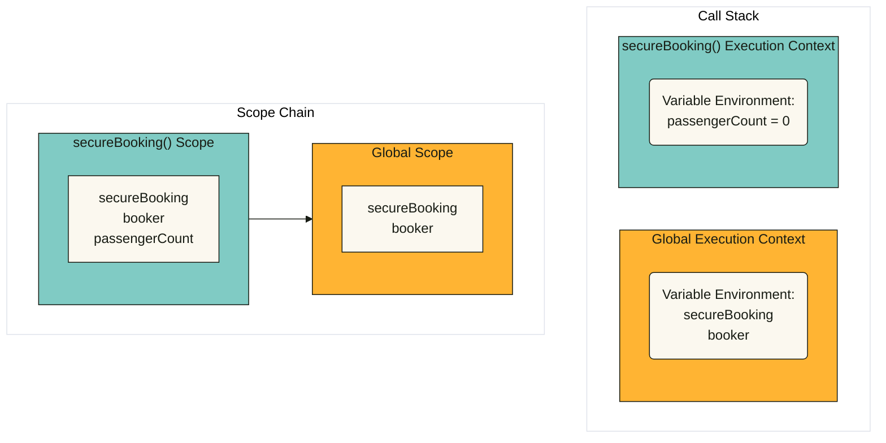
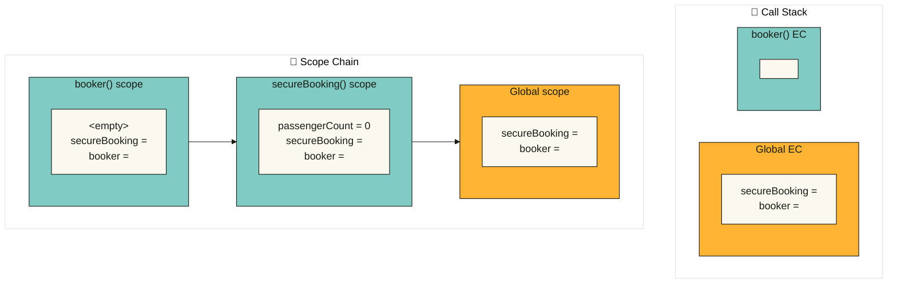

# 👀 Zoom into Functions

## 1 **Default Parameters in JavaScript**

This lesson introduces **default parameters** in JavaScript, which allow functions to have default values for parameters if no arguments are provided when the function is called. This feature simplifies function calls and eliminates the need for handling `undefined` values manually.

Initially, a basic function `createBooking` is created without default parameters. The function takes three parameters:

* `flightNum`: The flight number.
* `numPassengers`: The number of passengers.
* `price`: The ticket price.

It creates a `booking` object using the enhanced object literal syntax and pushes it into the `bookings` array.

**Code Example (Without Default Parameters)**

```js
const bookings = [];

const createBooking = function (flightNum, numPassengers, price) {
  const booking = {
    flightNum,
    numPassengers,
    price,
  };
  console.log(booking);
  bookings.push(booking);
};

createBooking('LH123');
```

<figure><figcaption><p>output in browser</p></figcaption></figure>

When calling `createBooking('LH123')`, the `numPassengers` and `price` fields are `undefined` because they were not specified in the function call.

### **1.1 Setting Default Parameters in ES5 (Old Method)**

Before ES6, developers used **short-circuiting with the OR (`||`) operator** to set default values:

```js
const createBooking = function (flightNum, numPassengers, price) {
  numPassengers = numPassengers || 1;// set the default values
  price = price || 199;

  const booking = { flightNum, numPassengers, price };
  console.log(booking);
  bookings.push(booking);
};

createBooking('LH123'); // { flightNum: "LH123", numPassengers: 1, price: 199 }
```

<figure><figcaption><p>output in browser</p></figcaption></figure>

:warning:The `||` operator does not distinguish between `undefined` and falsy values like `0` or `""`, leading to incorrect results in some cases.

### **1.2 Setting Default Parameters in ES6 (Modern Method)**

With **ES6 default parameters**, values are set directly in the function parameter list.

**Code Example (ES6 Default Parameters)**

```js
const createBooking = function (
  flightNum,
  numPassengers = 1,
  price = 199 * numPassengers
) {
  const booking = { flightNum, numPassengers, price };
  console.log(booking);
  bookings.push(booking);
};

createBooking('LH123'); // { flightNum: "LH123", numPassengers: 1, price: 199 }
createBooking('LH123', 2, 800); // { flightNum: "LH123", numPassengers: 2, price: 800 }
createBooking('LH123', 2); // { flightNum: "LH123", numPassengers: 2, price: 398 }
createBooking('LH123', 5); // { flightNum: "LH123", numPassengers: 5, price: 995 }
```

<figure><figcaption></figcaption></figure>

**Key Concept:**

* Default values **must** be set for parameters **declared before** the current one in the function definition.
* Example: Because we put `numPassengers`before `price` ,  `numPassengers` can be used inside `price`, but not vice versa.

:warning:If we want to keep a default value for a parameter while specifying later ones, we **cannot skip parameters** using `, ,`. Instead, we use `undefined`.

:x:**Incorrect Attempt:**

```js
createBooking('LH123', , 1000); 
```

<figure><figcaption></figcaption></figure>

:white\_check\_mark:**Correct Method:**

```js
createBooking('LH123', undefined, 1000);
```

<figure><figcaption></figcaption></figure>

:question:**Why?**\
Passing `undefined` is equivalent to **not specifying a value**, so the default value is used.

***

## 2 How Passing Argument Works?

This lesson explains how arguments are passed into functions in JavaScript, with a focus on the behavior of **primitive values** and **reference types (objects)**.

`flight` is a **primitive** (`string`), `jonas` is an **object** (reference type).&#x20;

#### **Code Example**

<pre class="language-js"><code class="lang-js">const flight = 'LH234';// flight is a primitive (string)
<strong>// jonas is an object (reference type)
</strong>const jonas = {
  name: 'Jonas Schmedtmann',
  passport: 24739479284,
};
const checkIn = function (flightNum, passenger) {
  flightNum = 'LH999';
  passenger.name = 'Mr. ' + passenger.name;

  if (passenger.passport === 24739479284) {
    alert('Checked in');
  } else {
    alert('Wrong passport!');
  }
};
</code></pre>

```javascript
checkIn(flight, jonas);// alert('Checked in');
console.log(flight); // 'LH234'
console.log(jonas);  // { name: 'Mr. Jonas Schmedtmann', passport: 24739479284 }
```

:question:After we used the `checkIn` function, why does only `passenger.name` (or `jonas.name`)reflect changes in the console, while `flightNum` remains unchanged?

#### :thumbsup: **Explanation**

**1. Primitive Values Are Passed by Value**

* `flight` is a string (primitive).
* Inside `checkIn`, the `flightNum` parameter is **a copy** of `flight`. Equivalent to: `const flightNum = flight;` .
* Modifying `flightNum` does **not** affect the original `flight`.

**2. Objects Are Passed by Reference (Actually: by Value of the Reference)**

* `jonas` is passed into `checkIn` as `passenger`. Equivalent to: `const passenger = jonas;` .
* JavaScript passes **the reference (memory address)** to the object.
* `passenger` and `jonas` point to **the same object in memory**.
* Thus, modifying `passenger.name` changes `jonas.name`.

#### :small\_blue\_diamond: **Pass by Value vs. Pass by Reference**

* **JavaScript does not support true pass-by-reference.**
* It **only** uses **pass-by-value**, even for objects.

| Type      | How it’s Passed       | Mutation Effects                       |
| --------- | --------------------- | -------------------------------------- |
| Primitive | By value (copy)       | Changes do **not** affect the original |
| Object    | By value of reference | Changes **do** affect the original     |

***

## **3 First-Class Functions vs. Higher-Order Functions**

### **3.1 First-Class Functions**

* JavaScript **treats functions as first-class citizens**.
* In practice, this means:
  * Functions are **simply values**.
  * Functions are just another **type of object**.

Because functions are values:

1.  **You can store functions in variables or object properties**:

    ```js
    const add = (a, b) => a + b;

    const counter = {
      value: 23,
      inc: function () {
        this.value++;
      },
    };
    ```
2.  **You can pass functions as arguments to other functions**:

    ```js
    const greet = () => console.log('Hey Jonas');
    btnClose.addEventListener('click', greet);
    ```
3.  **You can return functions from functions**:

    ```js
    function count() {
      let counter = 0;
      return function () {
        counter++;
      };
    }
    ```
4.  **You can call methods on functions**:

    ```js
    counter.inc.bind(someOtherObject);
    ```

### **3.2 Higher-Order Functions**

* A **higher-order function** is a function that:
  * **Returns a new function(returned function)**, or
  * **Takes another function as an argument** (This argument function is commonly known as a "callback function")
* This is **only possible because of first-class functions**.

**Examples of Higher-Order Functions:**

**1. Function Receiving Another Function**

```js
const greet = () => console.log('Hey Jonas');
btnClose.addEventListener('click', greet);
```

* `addEventListener` is the **higher-order function**.
* `greet` is the **callback function**.
* The callback is invoked **later**, after the event occurs.

**2. Function Returning Another Function**

```javascript
function count() {
  let counter = 0;
  return function () {
    console.log(++counter);
  };
}
// call the returned function
count()();// 1
// another way to call the returned function
const addedCounter = count();
addedCounter();// 1
```

* `count` is the **higher-order function**.
* It returns a **new function**, which has access to the outer scope.

#### ❗ **Clarifying the Confusion**

* **First-Class Functions**:
  * A **language feature**.
  * Means functions are treated as **values**.
  * Not a kind of function you write.
  * All functions in JavaScript are "first-class" because of this feature.
* **Higher-Order Functions**:
  * Functions you **write and use in practice**.
  * Either take other functions as arguments or return them.

***

## 4 The `call` and `apply` Methods

```js
const lufthansa = {
  airline: 'Lufthansa',
  iataCode: 'LH',
  bookings: [],
  book(flightNum, name) {
    console.log(`${name} booked a seat on ${this.airline} flight ${this.iataCode}${flightNum}`);
    this.bookings.push({ flight: `${this.iataCode}${flightNum}`, name });
  },
};
lufthansa.book(239, 'Jonas Schmedtmann');
lufthansa.book(635, 'John Smith');
const book = lufthansa.book;
book(23, 'Sarah Williams'); // Error
```

<figure><figcaption></figcaption></figure>

#### :x: Extracting the Method Loses Context

* When `book` is extracted as a standalone function and called directly, `this` becomes `undefined` (in strict mode), causing an error when trying to access properties like `this.airline`.

#### :white\_check\_mark:Fixing `this` with `.call()`

* The `call()` method allows **explicitly setting `this`** when calling a function.
* Syntax: `function.call(thisArg, arg1, arg2, ...)`

```js
const eurowings = {
  airline: 'Eurowings',
  iataCode: 'EW',
  bookings: [],
};

const swiss = {
  airline: 'Swiss Air Lines',
  iataCode: 'LX',
  bookings: [],
};
book.call(eurowings, 23, 'Sarah Williams');
book.call(lufthansa, 239, 'Mary Cooper');
book.call(swiss, 583, 'Mary Cooper');
```

<figure><figcaption></figcaption></figure>

`this` is explicitly set to different airline objects (`eurowings`, `lufthansa`, `swiss`), allowing the `book` function to be reused for different contexts.

#### :white\_check\_mark:Using `.apply()`

`.apply()` is similar to `.call()`, but it takes an array of arguments instead of listing them one by one.

```js
const flightData = [583, 'George Cooper'];
book.apply(swiss, flightData);
```

<figure><figcaption></figcaption></figure>

Same effect as:

```js
book.call(swiss, ...flightData);
```

The use of `.apply()` is now less common due to the convenience of using the spread operator `...` with `.call()`.

#### :tada: Summary

* **Issue**: Extracting methods from objects leads to a loss of `this` context.
* **Solution**: Use `.call()` or `.apply()` to explicitly set `this` when invoking the function.
  * `.call(thisArg, arg1, arg2, ...)` — pass arguments individually.
  * `.apply(thisArg, [arg1, arg2])` — pass arguments as an array.
* **Preferred Modern Way**: Use `.call()` with the spread operator instead of `.apply()`.

***

## 5 The `bind` Method

### :brain: 5.1 Understanding `bind`

* Like `call`, the `bind` method allows you to **manually set `this`**, but it **returns a new function** instead of calling it immediately.
*   Syntax:

    ```js
    const newFunc = originalFunc.bind(thisArg, presetArg1, presetArg2, ...)
    ```

### :airplane: 5.2 Example: Airline Booking System

**Setup:**

* Existing function: `book(flightNum, name)` defined inside the `lufthansa` object, also previously reused with `.call()` and `.apply()`.

```js
const lufthansa = {
    airline: 'Lufthansa',
    iataCode: 'LH',
    bookings: [],
    // book: function() {}
    book(flightNum, name) {
        console.log(
        `${name} booked a seat on ${this.airline} flight ${this.iataCode}${flightNum}`
        );
        this.bookings.push({ flight: `${this.iataCode}${flightNum}`, name });
    },
};
const eurowings = {
    airline: 'Eurowings',
    iataCode: 'EW',
    bookings: [],
};
const swiss = {
    airline: 'Swiss Air Lines',
    iataCode: 'LX',
    bookings: [],
};
const book = lufthansa.book;
```

:one:**Bind `this` to different airline objects:**

```js
const bookEW = book.bind(eurowings);
```

**Invoke bound function:**

```js
bookEW(23, 'Steven Williams');
```

<figure><figcaption></figcaption></figure>

`bookEW` is now a version of `book` with `this` permanently bound to `eurowings`.

#### :two: **Bind** **some arguments:**

You can pre-set not only `this`, but also **some arguments**:

```js
const bookEW23 = book.bind(eurowings, 23);
bookEW23('Jonas Schmedtmann');
```

<figure><figcaption></figcaption></figure>

Now `bookEW23` always uses flight number 23, only requiring the passenger's name.

#### :three:Event Listeners

```js
// add new properties for lufthansa
lufthansa.planes = 300;
lufthansa.buyPlane = function () {
  console.log(this);
  this.planes++;
  console.log(this.planes);
};
```

:x:**Problem:**

Using `this` inside an event handler method like:

```js
document.querySelector('.buy').addEventListener('click', lufthansa.buyPlane);
```

Fails because `this` refers to the **DOM element** (the button), not `lufthansa`.

:thumbsup:**Fix with `bind`:**

```js
document.querySelector('.buy').addEventListener('click', lufthansa.buyPlane.bind(lufthansa));
```

This ensures that inside `buyPlane`, `this` still points to the `lufthansa` object. Try this code on the website below.

[](https://codesandbox.io/p/sandbox/zpljff)

***

## 6 Immediately Invoked Function Expressions (IIFE)

:small\_blue\_diamond:**Standard Function Declaration**

```js
const runOnce = function () {
  console.log('This will never run again');
};
runOnce();
```

* Although it only runs once here, it **can be called again** later.
* This is **not sufficient** when we want to ensure the function **runs only once and then disappears**.

#### :small\_blue\_diamond:Immediately Invoked Function Expressions (IIFE):

```js
(function () {
  console.log('This will never run again');
  const isPrivate = 23;
})();
```

* Wrapped in parentheses to **convert a function declaration into an expression**.
* **Immediately invoked** by appending `()` at the end.
* The variable `isPrivate` is **not accessible outside** due to function scope.

:small\_blue\_diamond:**Arrow Function IIFE**

```js
(() => console.log('This will ALSO never run again'))();
```

* Same effect using an **arrow function**.
* Called immediately upon definition.

#### :eyes: Purpose of IIFE

* To create a **private scope** and **avoid polluting the global scope**.
* Useful for **data encapsulation**, a key programming concept.
* Prevents **accidental overwrites** or **external access** to sensitive variables.

***

## 7 Closure

### 7.1 Concept Introduction:

:point\_right:A closure is the closed-over variable environment of the execution context in which a function was created, even after that
&#x20;execution context is gone;
\
:point\_right:Less formal: A closure gives a function access to all the variables of its parent function, even after that parent function has returned. The
&#x20;function keeps a reference to its outer scope, which preserves the scope chain throughout time.
\
:point\_right:Less formal: A closure makes sure that a function doesn’t loose connection to variables that existed at the function’s birth place;
\
:point\_right:Less formal: A closure is like a backpack that a function carries around wherever it goes. This backpack has all the variables that were
&#x20;present in the environment where the function was created.
\

:warning:We **do NOT** have to manually create closures, this is a JavaScript feature that happens automatically. We can’t even
&#x20;access closed-over variables explicitly. A closure is NOT a tangible JavaScript object.

### 7.2 Step by Step Breakdown

```js
const secureBooking = function () {
  let passengerCount = 0;

  return function () {
    passengerCount++;
    console.log(`${passengerCount} passengers`);
  };
};

const booker = secureBooking();

booker();// 1 passengers
booker();// 2 passengers
booker();// 3 passengers

console.dir(booker);
```

<figure><figcaption></figcaption></figure>

#### 🔍 Inspection with `console.dir(booker);`

* This command shows internal properties of the function object.
* You’ll find `[[Scopes]]`, where the closure appears. （we cannot access the properties within a `[[properties]]`）
* It includes the `passengerCount` variable, even though `secureBooking()` is no longer on the call stack.

Step by Step:

:one:**`const booker = secureBooking();` In the Call stack, global execution context(EC), and secureBooking EC are created.**

EC: Order in which
&#x20;functions were called :vs:Scope Chain: Order in which functions
&#x20;are written in the code.



&#x20;:two:**`booker();`secureBooking EC was returned, and the booker EC was created.**

Variable environment (VE) that popped off stack after `secureBooking`
. Because of the closure, secureBooking VE was moved to heap and <mark style="color:red;">**NOT garbage collected**</mark>
. Even after `secureBooking` has finished executing, the inner function retains a **reference** to its **parent scope** (i.e., the variable `passengerCount`).



